这一章会介绍 Visual Fortran 在 FORTRAN 标准外所扩充的功能，主要分成两大部分；第一部分会介绍 Visual Fortran 的扩充函数，第二部分会介绍 Visual Fortran 的绘图功能。

## 17-1   Visual Fortran 扩充函数

Visual Fortran中提供了很多让FORTRAN跟操作系统通信的函数，这些函数都封装在MODULE DFPORT中。调用这些函数前，请先确认程序代码中有使用USE DFPORT这一行命令。

+ `integer(4) function IARGC()`

    返回执行时所传入的参数个数

+ `subroutine GETARG(n, buffer)`

    用命令列执行程序时，可以在后面加上一些参数来执行程序，使用GETARG可以取出这些参数的内容。

    | | |
    | --- | --- |
    |`integer n` |决定要取出哪个参数|
    |`character*(*) buffer` |返回参数内容|

FORTRAN 程序编译好后，执行程序时可以在命令列后面加上一些额外的参数。假如有一个可执行文件为 `a.exe`，执行时若输入 `a –o –f`，在 `a` 之后的字符串都会被当成参数。这时候执行 `a –o -f` 时，调用函数 `IARGC` 会得到2，因为总共传入了两个参数。调用函数 `GETARGC(1,buffer)` 时，字符串 `buffer="-o"`，也就是第1个参数的值。

+ `subroutine GETLOG(buffer)`

    查询目前登录计算机的使用者名称。

    `character*(*) buffer` 返回使用者名称

+ `integer(4) function HOSTNAM(buffer)`

    查询计算机的名称，查询动作成功完成时函数返回值为0。buffer字符串长度不够使用时，返回值为-1。

    `character*(*) buffer` 返回计算机的名称

程序执行时，工作目录是指当打开文件时，没有特别指定目录位置时会使用的目录。通常这个目录就是执行文件的所在位置，在程序进行中可以查询或改变这个目录的位置。

+ `integer function GETCWD(buffer)`

    查询程序目前的工作目录位置，查询成功时函数返回0。

+ `integer function CHDIR(dir_name)`

    把工作目录转换到dir_name字符串所指定的目录下，转换成功时返回0。

扩充的文件相关函数，补充了一些原本的缺失。INQURE命令可以用来查询文件信息，不过它并没有提供很详细的信息，例如文件大小就没有辨法使用INQUIRE来查询。

+ `integer(4) function STAT(name, statb)`

    查询文件的数据，结果放在整数数组statb中。查询成功时函数返回值为0。

    | | |
    | --- | --- |
    |`character*(*) name`   |所要查询的文件名。|
    |`integer statb(12)`    |查询结果，每个元素代表某一个属性，statb(8)代表文件长度，单位为bytes。其它值请参考使用说明。|

+ `integer(4) function RENAME( from , to )`

    改变文件名称，改名成功时返回0。

    | | |
    | --- | --- |
    |`character*(*) from` |原始文件名|
    |`character*(*) to`   |新文件名|

程序执行时，可以经由函数SYSTEM再去调用另外一个程序来执行。

+ `integer(4) function SYSTEM( command )`

    让操作系统执行command字符串中的命令。

+ `subroutine QSORT( array, len, size, compar )`

    使用Quick Sort算法把传入的数组数据排序。

    | | |
    | --- | --- |
    |`array`|任意类型的数组|
    |`integer(4) len`|数组大小|
    |`integer(4) size`|数组中每个元素所占用的内存容量|
    |`integer(2), external :: compar`|使用者必须自行编写比较两笔数据的函数，函数compar会自动传入两个参数a、b。当a要排在b之前时，compar要返回负数，a、b相等时请返回0，a要排在b之后时，compar要返回正数。|


*QSORT.F90*
```f90
  1.program main ! 使用QSORT函数的范例
  2.  use DFPORT
  3.  implicit none
  4.  integer :: a(5) = (/ 5,3,1,2,4 /)
  5.  integer(2), external :: compareINT
  6.  call QSORT( a, 5, 4, compareINT )
  7.  write(*,*) a
  8.  stop
  9.end program
 10.! 要自行提供比较大小用的函数
 11.integer(2) function compareINT(a,b)
 12.  implicit none
 13.  integer a,b
 14.  if ( a<b ) then
 1.   compareINT=-1 ! a排在b之前
 16.  else if ( a==b) then
 17.  compareINT=0
 18.  else
 19.  compareINT=1 ! a排在b之后
 20.  end if
 21.  return
 22.end function
```


----


## 17-2   Visual Fortran 的绘图功能

第12章的SGL是笔者提供的绘图函数库，Visual Fortran中另外有提供绘图功能。Visual Fortran的绘图功能不完全是以扩充函数的类型存在，使用它的绘图功能必须在选择Project类型时，选择Standard Graphics或QuickWin模式。

Visual Fortran提供的绘图方法，跟SGL比较起来算是各有利弊。SGL使用比较简单的参数接口，使用效率比较好的DirectX，支持Double Buffer动画功能，而且并不限制只能在Visual Fortran中使用。Visual Fortran的QuickWin及Standard Graphics模式在简单的绘图使用上会比较方便，不像SGL必须自行处理一些窗口信息。它的绘图函数功能比较多样，不过效率会比较差，而且不支持动画功能。

Standard Graphics和QuickWin模式在绘图方面的使用方法完全相同，它们都是调用相同的函数来绘图。差别在于Standard Graphics只能打开一个窗口来绘图、QuickWin模式则可以打开多个窗口来绘图。QuickWin模式下可以有菜单及对话窗的功能，Standard Graphics则不行。Standard Graphics模式的程序代码可以原封不动直接转换到QuickWin模式下使用，但是QuickWin的程序代码并不一定可以直接拿到Standard Graphics模式下使用。

### 17-2-1   基本绘图功能范例

这个小节没有什么新的概念，只会范例Visual Fortran绘图函数的使用方法。直接来看一个范例程序。这个程序会在屏幕上画出一条斜线、一个方形及一个椭圆。

编译程序时，请选择Fortran Standard Graphics or QuickWin Application这个模式。这个程序可以在Standard Graphics或QuickWin模式下使用。打开好Project后，再把下面的程序加入Project中来编译。

*PLOT.F90*
```f90
1.! 简单的绘图范例
2.! By Perng 1997/9/19
3.program Plot_Demo
4.! 使用Visual Fortran的绘图功能时需要module dflib
5.use DFLIB
6.implicit none
7.  type(xycoord) :: t
8.  integer :: result
9.  call MoveTo(10,10,t)  ! 把目前绘图的位置移动到坐标(10,10)
10.  result=LineTo(100,50) ! 从(10,10)到(100,50)间绘一条直线
11.  ! 画一个左上角为(110,10), 右下角为(150,50)的实心方形
12.  result=Rectangle( $GFILLINTERIOR, 110,10, 150, 50 )
13.  ! 画一个可以放入在(10,60)--(150,100)方形当中的空心椭圆
14.  result=Ellipse($GBORDER, 10, 60, 150, 100)
15.end program Plot_Demo
```

使用Standard Graphics模式时，会出现一个绘图窗口来画图。使用QuickWin模式时，除了绘图窗口外，还有内定的菜单可以使用。File菜单中的Print可以把图形显示出，Save可以把绘图结果储存成 `*.BMP` 图文件。

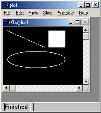图 17.1

+ `PLOT.F90` 用QuickWin模式编译的结果

使用Visual Fortran的绘图功能时，打开窗口的工作是自动完成的。程序代码只需要直接调用绘图函数就可以进行绘图，下面对程序中所使用的绘图函数做一些介绍：

+ `subroutine MoveTo(x,y,t)`

    使用这个子程序时，要先把屏幕想像成一张画纸，程序会使用一只画笔在屏幕上画画。MoveTo(x,y,t)可以把这只画笔移动到画纸上的(x,y)坐标处，参数t则会返回移动之前的画笔所在位置（这个参数其实没有什么用，不过既然有规定就一定要把它放入）。

    请注意，原点(0,0)是位在窗口的左上角，x坐标轴向右为正，y坐标轴向下为正。

+ `integer(2) function LineTo(x,y)`

    这个函数可以把画笔从目前的位置到(x,y)处画一条直线。返回值如果不为0，代表函数运行不正常。

+ `integer(2) function Rectangle( control, x1, y1, x2, y2 )`

    这个函数可以在(x1,y1)、(x2,y2)两个端点间画出一个方形。control值可以用来设定是要画出一个实心方形或是只有外框而已。在范例中把control的值用 `$GFILLINTERIOR` 来代入，表示要画实心。`$GFILLINTERIOR` 定义在MODULE DFLIB里面。

+ `integer(2) function Ellipse(control,x1,y1,x2,y2)`

    这个函数会在(x1,y1)、(x2,y2)两端点间所形成的矩形中画椭圆。control的意义同上，在范例中使用 `$GBORDER`，代表只画出外框。

再来看一个范例，它会画出SIN函数的图形。

*SIN.F90*
```f90
  1.! sin函数的绘图范例
  2.program Plot_Sine
  1. use DFLIB
  4.implicit none
  5.  integer, parameter :: lines=500  ! 用多少线段来画函数曲线
  6.  real(kind=8), parameter :: X_Start=-5.0  ! x轴最小范围
  7.  real(kind=8), parameter :: X_End=5.0  ! x轴最大范围
  8.  real(kind=8), parameter :: Y_Top=2.0  ! y轴最大范围
  9.  real(kind=8), parameter :: Y_Bottom=-2.0  ! y轴最小范围
 10.  integer :: result  ! 取回绘图函数运行状态
 11.  integer(kind=2) :: color  ! 设定颜色用
 12.  real(kind=8) :: step  ! 循环的增量
 13.  real(kind=8) :: x,y  ! 绘图时使用,每条小线段都连接
 14.  real(kind=8) :: NewX,NewY ! (x,y)及(NewX,NewY)
 15.  real(kind=8), external :: f ! 待绘图的函数
 16.  type(wxycoord) :: wt  ! 返回上一次的虚拟坐标位置
 17.  type(xycoord)  :: t  ! 返回上一次的实际坐标位置
 18.
 19.  ! 设定虚拟坐标范围大小
 20.  result=SetWindow( .true. , X_Start, Y_Top, X_End, Y_Bottom )
 21.  ! 用索引值的方法来设定颜色
 22.  result=SetColor(2)  ! 内定的2号是应该是绿色
 23.  call MoveTo(10,20,t) ! 移动画笔到窗口的(10,20)
 24.  call OutGText("f(x)=sin(x)")  ! 写出内容
 25.  ! 使用全彩RGB 0-255的256种色阶来设定颜色
 26.  color=RGBToInteger(255,0,0)  ! 把控制RGB的三个值转换到color中
 27.  result=SetColorRGB(color)  ! 利用color来设定颜色
 28.
 29.  call MoveTo_W(X_Start,0.0_8,wt)  ! 画X轴
 30.  result=LineTo_W(X_End,0.0_8)  !
 31.  call MoveTo_W(0.0_8,Y_Top,wt)  ! 画Y轴
 32.  result=LineTo_W(0.0_8,Y_Bottom)  !
 33.
 34.  step=(X_End-X_Start)/lines  ! 计算小线段间的X间距
 35.  ! 参数#FF0000是使用16进制的方法来表示一个整数
 36.  result=SetColorRGB(#FF0000)
 37.  ! 开始绘制小线段们
 38.  do x=X_Start,X_End-step,step
 39.  y=f(x)  ! 线段的左端点
 40.  NewX=x+step
 41.  NewY=f(NewX)  ! 线段的右端点
 42.  call MoveTo_W(x,y,wt)
 43.  result=LineTo_W(NewX,NewY)
 44.  end do
 45.  ! 设定程序结束后,窗口会继续保留
 46.  result=SetExitQQ(QWIN$EXITPERSIST)
 47.end
 48.! 所要绘图的函数
 49.real(kind=8) function f(x)
 50.implicit none
 51.  real(kind=8) :: x
 52.  f=sin(x)
 53.  return
 54.end function f
```

这个程序会以目前Windows分辨率的大小来打开绘图窗口。程序执行后只能够看到窗口的一小部分，读者可以试着按下Alt+Enter来把窗口放大成全屏幕大小，不然看不到全部的图形。使用QuickWin模式时，并不像使用SGL时一样可以得到窗口大小改变的信息，所以QuickWin下的虚拟坐标是对固定分辨率来对应，不会随着窗口大小改变而缩放图形。

把这个程序中新使用的绘图函数做一个介绍

+ `integer(2) function SetWindow( invert, x1,y1, x2,y2 )`

    用来设定虚拟坐标，invert的值是用来指定Y轴向上为正或为负。invert=.true.时向上为正，invert=.false.时向下为负。(x1,y1)、(x2,y2)则使用双精度浮点数来定义绘图范围两端的虚拟坐标值。

+ `integer(2) function SetColor(index)`

    使用索引值的方法来设定所要使用的颜色。

+ `subroutine OutGText( text )`

    调用这个子程序可以在目前画笔的位置上写出text字符串。

+ `integer(4) function RGBToInteger(R,G,B)`

    前面有提过，全彩模式中，RGB三种色光可以各自有256种色阶变化，所以一个颜色需要使用3 bytes的空间来做记录。但是FORTRAN中通常一个整数使用4 bytes的空间来做记录，如果分别使用3个变量来记录一个颜色值会很浪费空间，因为这3个变量都只会使用到最低的8个位，其它地方都不会使用。

    这个函数可以重新组合R G B这三个传入的整数，取出这三个整数中最低8个位的数值，把它重新安排到返回值color中。color中的第0~7 bits用存放原本的R，8~15 bits会存放原本的G，16~23 bits会存放原本的B，剩下第24~31 bits的空间则不会使用。

+ `integer(2) function SetColorRGB( color )`

    用RGB方法来设定颜色，参数color中的第0~7个bits用来设定红光，第8~15 bits用来设定绿光，第16~23 bits用来设定蓝光，其它位不使用。在范例当中曾使用 `SetColorRGB(#FF0000)` 来设定颜色，在Visual Fortran中以#符号开头的数字，代表一个16进制的数字。

    16进制数值在0~9时和10进制数字相同，但是接在9下面的数字为A、B、C、D、E、F。其中A等于10进制的10，B=11，C=12.....，同理可推得1016=16，FF16=255。使用16进制的系统可以比较容易来操作这种需要控制到位内容的数值。正规的FORTRAN 90写法应该用Z”FF0000”来设定16进制的数值，第5章的最后一节有介绍这个方法。在此顺便范例一下Visual Fortran的扩充语法。


----


## 17-3   互动功能

这一节要介绍QuickWin模式下，使用者和程序间的互动功能。鼠标及菜单、对话窗等等的工具，都是本节所要讨论的范围。

### 17-3-1   传统的键盘输入

如果读者想把原先发展好的程序，转换到QuickWin模式下来使用，还是可以使用READ/WRITE命令来输出入。

下面的范例程序会根据使用者的选择来画出函数图形。程序执行后，会出现两个小窗口，一个窗口会负责读取键盘的输入，另一个窗口则负责绘图。

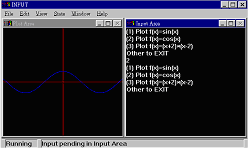图 17.2

这个程序打开了两个窗口，分别用来做绘图及输入的工作。读者可以注意到绘图部分的程序代码和上一节的程序一模一样，不过这个程序把绘图窗口缩小了，所以不经过放大就可以看到全部的图形。因为绘图坐标系是使用虚拟坐标，所以图形的相对位置不会因窗口分辨率而改变。

*INPUT.F90* (QuickWin模式)
```f90
  1.! Interactive的绘图范例
  2.! By Perng 1997/9/20
  3.program Plot_Sine
  4.use DFLIB
  5.implicit none
  6.  logical :: result
  7.  integer :: input
  8.  type(WindowConfig) :: wc
  9.  real(kind=8), external :: f1,f2,f3  ! 所要画的函数
 10.  ! 打开输入用的窗口
 11.  open(unit=5,file='user',iofocus=.true.)
 12.  ! -1 代表由程序自行去做决定
 13.  wc.numxpixels=300 ! 窗口的宽
 14.  wc.numypixels=300 ! 窗口的高
 15.  wc.numtextcols=-1 ! 每行可容纳的文字
 16.  wc.numtextrows=-1 ! 可以有几列文字
 17.  wc.numcolors=-1  ! 可以使用的颜色
 18.  wc.title="Input Area"C ! 窗口的标题文字
 19.  wc.fontsize=-1  ! 所使用的文字大小
 20.  ! 根据wc中所定义的数据来重新设定窗口大小
 21.  result=SetWindowConfig(wc)
 22.  result=DisplayCursor($GCURSORON) ! 显现出光标
 23.  ! 打开绘图所要使用的窗口
 24.  open(unit=10,file='user',iofocus=.true.)
 25.  wc.numxpixels=300 ! 窗口的宽
 26.  wc.numypixels=300 ! 窗口的高
 27.  ! -1代表让程序自行去做决定
 28.  wc.numtextcols=-1 ! 每行容量的文字
 29.  wc.numtextrows=-1 ! 可以有几列文字
 30.  wc.numcolors=-1  ! 使用多少颜色
 31.  wc.title="Plot Area"C ! 窗口的标题
 32.  wc.fontsize=-1
 33.  ! 根据wc中所定义的数据来重新设定窗口大小
 34.  result=SetWindowConfig(wc)
 35.  ! 程序自动按下菜单中Windows的Tile命令, 使两个窗口之间
 36.  ! 不会互相重叠
 37.  result=ClickMenuQQ(QWIN$TILE)
 38.  input=1 ! 随便给一个合理的值, 不然不能进入下面的循环
 39.  ! 把输入使用的窗口设为可以被输入的状态, 5就是第一次打开
 40.  ! 绘图窗口时所用的unit值
 41.  result=FocusQQ(5)
 42.  do while( input>0 .and. input<4 )
 1.   write(5,*) '(1) Plot f(x)=sin(x)'
 44. write(5,*) '(2) Plot f(x)=cos(x)'
 45. write(5,*) '(3) Plot f(x)=(x+2)*(x-2)'
 46. write(5,*) 'Other to EXIT'
 47. read(5,*) input
 48. result=SetActiveQQ(10) ! 把绘图命令指定到绘图窗口的代码上
 49. ! 根据input来决定要画出那一个函数
 50. select case(input)
 51. case (1)
 52.   call Draw_Func(f1)
 53. case (2)
 54.   call Draw_Func(f2)
 55. case (3)
 56.   call Draw_Func(f3)
 57. end select
 58.  end do
 59.  ! 设定主程序代码结束后,窗口会自动关闭
 60.  result=SetExitQQ(QWIN$EXITNOPERSIST)
 61.end program Plot_Sine
 62.
 63.subroutine Draw_Func(func)
 64.use DFLIB
 65.implicit none
 66.  integer, parameter :: lines=500  ! 用多少线段来画函数曲线
 67.  real(kind=8), parameter :: X_Start=-5.0 ! x轴最小范围
 68.  real(kind=8), parameter :: X_End=5.0  ! x轴最大范围
 69.  real(kind=8), parameter :: Y_Top=5.0  ! y轴最大范围
 70.  real(kind=8), parameter :: Y_Bottom=-5.0  ! y轴最小范围
 71.  integer :: result  ! 取回绘图函数运行状态
 72.  integer(kind=2) :: color  ! 设定颜色用
 73.  real(kind=8) :: step  ! 循环的增量
 74.  real(kind=8) :: x,y  ! 绘图时使用,每条小线段都连接
 75.  real(kind=8) :: NewX,NewY ! (x,y)及(NewX,NewY)
 76.  real(kind=8), external :: func ! 待绘图的函数
 77.  type(wxycoord) :: wt  ! 返回上一次的虚拟坐标位置
 78.  type(xycoord)  :: t  ! 返回上一次的实际坐标位置
 79.
 80.  call ClearScreen($GCLEARSCREEN) ! 清除屏幕
 81.  ! 设定虚拟坐标范围大小
 82.  result=SetWindow( .true. , X_Start, Y_Top, X_End, Y_Bottom )
 83.  ! 用索引值的方法来设定颜色
 84.  result=SetColor(2)  ! 内定的2号是应该是绿色
 85.  call MoveTo(10,20,t) ! 移动画笔到窗口的(10,20)
 86. 
 87.  ! 使用全彩RGB 0-255的256种色阶来设定颜色
 88.  color=RGBToInteger(255,0,0)  ! 把控制RGB的三个值转换到color中
 89.  result=SetColorRGB(color) ! 利用color来设定颜色
 90.
 91.  call MoveTo_W(X_Start,0.0_8,wt)  ! 画X轴
 92.  result=LineTo_W(X_End,0.0_8)  !
 93.  call MoveTo_W(0.0_8,Y_Top,wt)  ! 画Y轴
 94.  result=LineTo_W(0.0_8,Y_Bottom)  ! 
 95.  step=(X_End-X_Start)/lines  ! 计算小线段间的X间距
 96.  ! 参数#FF0000是使用16进制的方法来表示一个整数
 97.  result=SetColorRGB(#FF0000)
 98.  ! 开始绘制小线段
 99.  do x=X_Start,X_End-step,step
100.  y=func(x)  ! 线段的左端点
101. NewX=x+step
102. NewY=func(NewX)  ! 线段的右端点
103. call MoveTo_W(x,y,wt)
104. result=LineTo_W(NewX,NewY)
105.  end do
106.  ! 设定程序结束后,窗口会继续保留
107.  result=SetExitQQ(QWIN$EXITPERSIST)
108.end subroutine Draw_Func
109.! 所要绘图的函数
110.real(kind=8) function f1(x)
111.implicit none
112.  real(kind=8) :: x
113.  f1=sin(x)
114.  return
115.end function f1
116.real(kind=8) function f2(x)
117.implicit none
118.  real(kind=8) :: x
119.  f2=cos(x)
120.  return
121.end function f2
122.real(kind=8) function f3(x)
123.implicit none
124.  real(kind=8) :: x
125.  f3=(x+2)*(x-2)
126.  return
127.end function f3
```

程序代码中已经有相当份量的注释，在此只对一些重点做说明。QuickWin模式下的程序，打开一个名称为USER的文件时，就会打开一个新的子窗口；因为这个窗口永远只存在于程序窗口范围中，不会跑到外面，所以叫子窗口。

打开USER文件时所使用的UNIT值，会成为这个窗口的代号。在QuickWin中，使用WRITE/READ时，只要把输出入位置指定到子窗口中，就可以对某个子窗口来做读写。用这个方法来做输出入，可以让旧程序做最少的更改就具备绘图功能。

还有一点要注意的，这个程序打开了两个子窗口，所以在绘图时，要指定绘图的动作要画在哪个窗口上，这个工作是由函数SetActiveQQ来完成。

### 17-3-2   鼠标的使用

直接由范例程序来学习鼠标的使用方法。这个范例程序仿真了一只画笔，按下鼠标左键画笔就会落下，在屏幕上画出一个红色小点。屏幕左上角还会显示出目前鼠标在窗口中的位置。

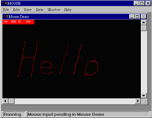图 17.3

*MOUSE.F90* (QuickWin模式)
```f90
  1.! 处理鼠标事件的函数
  2.module MouseEvent
  3.use DFLIB
  4.implicit none
  5.Contains
  6.  ! 鼠标在窗口中每移动一次,就会调用这个函数
  7.  subroutine ShowLocation(iunit, ievent, ikeystate, ixpos, iypos)
  8.  implicit none
  1.  integer :: iunit  ! 鼠标所在的窗口的unit值
 1.   integer :: ievent  ! 鼠标发生的信息码
 2.   integer :: ikeystate  ! 进入这个函数时,其它控制键的状态
 3.   integer :: ixpos,iypos  ! 鼠标在窗口中的位置
 4.   type(xycoord) :: t
 5.   integer :: result
 6.   character(len=15) :: output ! 设定输出的字符串
 16.
 17.  result=SetActiveQQ(iunit)  ! 把绘图工作指向这个窗口
 18.  write(output,100) ixpos,iypos  ! 把鼠标所在位置的信息写入output
 19.100 format("(X:",I4," Y:",I4,")")  !
 20.  result=SetColorRGB(#1010FF)
 21.  result=Rectangle($GFILLINTERIOR,0,0,120,18) ! 画一个实心方形
 22.  result=SetColorRGB(#FFFFFF)
 23.  call MoveTo( 4,2,t)
 24.  call OutGText(output)  ! 写出信息
 25.  ! 如果鼠标移动时, 左键同时被按下, 会顺便画出一个点.
 26.  if ( ikeystate==MOUSE$KS_LBUTTON ) then
 27.  result=SetColorRGB(#0000FF)
 28.  result=SetPixel(ixpos,iypos)
 29.  end if
 30.  return
 31.  end subroutine
 32.  ! 鼠标右键按下时, 会执行这个函数
 33.  subroutine MouseClearScreen(iunit, ievent, ikeystate, ixpos, iypos )
 34.  implicit none
 35.  integer :: iunit  ! 鼠标所在的窗口的unit值
 36.  integer :: ievent  ! 鼠标发生的信息码
 37.  integer :: ikeystate  ! 进入这个函数时,其它控制键的状态
 38.  integer :: ixpos,iypos  ! 鼠标在窗口中的位置
 39.  type(xycoord) :: t
 40.  integer :: result
 41.
 42.  result=SetActiveQQ(iunit)  ! 把绘图动作设定在鼠标所在窗口上
 43.  call ClearScreen($GCLEARSCREEN) ! 清除整个屏幕
 44.
 45.  return
 46.  end subroutine
 47.end module
 48.
 49.program Mouse_Demo
 50.use DFLIB
 51.use MouseEvent
 52.implicit none
 53.  integer :: result
 54.  integer :: event
 55.  integer :: state,x,y
 56.
 57.  result=AboutBoxQQ("Mouse Draw Demo\r By Perng 1997/09"C)
 58.  ! 打开窗口
 59.  open( unit=10, file='user', title='Mouse Demo', iofocus=.true. )
 60.  ! 使用字形前, 一定要调用InitializeFonts
 61.  result=InitializeFonts()
 62.  ! 选用Courier New的字形在窗口中来输出
 63.  result=setfont('t''Courier New''h14w8')
 64.  call ClearScreen($GCLEARSCREEN)  ! 先清除一下屏幕
 65.  ! 设定鼠标移动或按下左键时, 会调用ShowLocation
 66.  event=ior(MOUSE$MOVE,MOUSE$LBUTTONDOWN)
 67.  result=RegisterMouseEvent(10, event, ShowLocation)
 68.  ! 设定鼠标右键按下时, 会调用MouseClearScreen
 69.  event=MOUSE$RBUTTONDOWN
 70.  result=RegisterMouseEvent(10, event, MouseClearScreen )
 71.  ! 把程序放入等待鼠标输入的状态
 72.  do while(.true.)
 73.  result=WaitOnMouseEvent( MOUSE$MOVE .or. MOUSE$LBUTTONDOWN .or.&
 74.  MOUSE$RBUTTONDOWN, state, x, y )
 75.  end do
 76.end program
```

这个程序使用的观念，有点类似编写SGL程序的方法。读者也许会觉得很奇怪，为什么主程序最后要进入一个无穷循环中？为什么写了一些处理鼠标信息的函数，却没有看到程序代码去调用它，但是它却还是会被执行？

程序代码第72～75行的部分，用循环来等待Windows操作系统所传递的鼠标信息，这就是在第73行调用WaitOnMouseEvent的目的。Windows操作系统在暗地里会偷偷塞给应用程序许多信息，只是有很多信息会被应用程序忽略。这个程序会处理跟鼠标相关的信息。

在QuickWin的程序中，如果按下菜单Help的About选项，会出现一个About窗口。按下菜单File中的Save选项时，可以把画面储存成一个图文件。这几个处理信息的程序代码，都由Visual Fortran事先准备好。程序可以多增加几个处理信息的程序代码，来增加互动能力。

`MOUSE.F90` 中，增加了处理鼠标移动及按下鼠标左、右键信息的程序。程序代码第66、67两行会设定当鼠标在代号为10的窗口中移动、或是按下左键时，会自动调用子程序ShowLocation来执行。

```f90
66.  event=ior(MOUSE$MOVE,MOUSE$LBUTTONDOWN)
67.  result=RegisterMouseEvent(10, event, ShowLocation)
```

第69、70这两行程序代码，则会设定当鼠标右键按下时，会自动调用子程序MouseClearScreen。

```f90
69.  event=MOUSE$RBUTTONDOWN
70.  result=RegisterMouseEvent(10, event, MouseClearScreen )
```

读者所看到的一些 `MOUSE$…`.开头的奇怪数值，都是声明在 `MODULE DFLIB` 中的常数。这些数值都是鼠标信息的代码，鼠标可以产生出下列的信息：

| | |
| --- | --- |
|`MOUSE$LBUTTONDOWN`    | 按下左键|
|`MOUSE$LBUTTONUP`      | 放开左键|
|`MOUSE$LBUTTONDBLCLK`  | 左键连按两下|
|`MOUSE$RBUTTONDOWN`    | 按下右键|
|`MOUSE$RBUTTONUP`      | 放开右键|
|`MOUSE$RBUTTONDBLCLK`  | 右键连按两下|
|`MOUSE$MOVE`           | 鼠标移动|

`RegisterMouseEvent` 需要3个参数，第1个参数设定的是：「需要拦截信息的窗口代码」，第2个参数设定所要处理的鼠标信息，第3个参数则传入一个子程序的名字，指定在收到信息时，会自动执行这个子程序。处理鼠标信息的子程序被调用时，会传入下列的参数：

+ `subroutine MouseEventHandleRoutine(iunit,ievent, ikeystate, ixpos, iypos)`

    | | |
    | --- | --- |
    |`integer iunit`    |得到鼠标信息的窗口代码|
    |`integer ievent`   |鼠标信息代码|
    |`integer ikeystate`|其它功能键的状态|
    |`integer ixpos`    |鼠标在窗口中X轴的位置|
    |`integer iypos`    |鼠标在窗口中Y轴的位置|

要编写鼠标信息处理函数时，一定要遵照这些参数类型来声明参数，不然在程序执行时会发生错误。注意：这种类型错误在编译程序时不会被发现，一定要程序员自己小心才行。

根据笔者实验的结果，范例程序在主程序最后的循环，拿掉后一样可以正常执行程序，程序还是可以得到鼠标信息，但是建议不要这么做。因为原本的做法比较「正规」，而且如果在程序中新增菜单功能，这个循环就不能省略。

### 17-3-3   菜单的使用

QuickWin模式下的程序，不需要程序员特别设计，先天上就都具备菜单功能。这个小节会介绍改变菜单预设内容的方法。

在程序中使用菜单的方法，和使用鼠标的原理大致相同。只要先设计好菜单内容，再设定按下选项时，会自动执行那个函数就好了。下面的范例程序可以让使用者从菜单中选择要画出SIN(x)或COS(x)的图形。

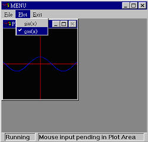图 17.4

这个程序和上一个范例程序很类似，只不过把输入改由菜单来做。

*MENU.F90*
```f90
  1.! 使用菜单范例
  2.! By Perng 1997/9/22
  3.program Menu_Demo
  4.use DFLIB
  5.implicit none
  6.  type(windowconfig) :: wc
  7.  integer :: result 
  8.  integer :: i,ix,iy
  9.  wc.numxpixels=200 ! 窗口的宽
 10.  wc.numypixels=200 ! 窗口的高
 11.  ! -1代表让程序自行去做决定
 12.  wc.numtextcols=-1 ! 每行容量的文字
 13.  wc.numtextrows=-1 ! 可以有几列文字
 14.  wc.numcolors=-1  ! 使用多少颜色
 15.  wc.title="Plot Area"C ! 窗口的标题
 16.  wc.fontsize=-1
 17.  ! 根据wc中所定义的数据来重新设定窗口大小
 18.  result=SetWindowConfig(wc)
 19.  ! 把程序放入等待鼠标信息的状态
 20.  do while (.TRUE.)
 1.   i = waitonmouseevent(MOUSE$RBUTTONDOWN, i, ix, iy)
 22.  end do
 23.end program
 24.!
 25.! 程序会自动执行这个函数, 它会设定窗口的外观
 26.!
 27.logical(kind=4) function InitialSettings()
 28.use DFLIB
 29.implicit none
 30.  logical(kind=4) :: result
 31.  type(qwinfo) :: qw
 32.  external PlotSin,PlotCos 
 33. 
 34.  ! 设定整个窗口程序一开始出现的位置及大小
 35.  qw.type=QWIN$SET
 36.  qw.x=0
 37.  qw.y=0
 38.  qw.h=400
 39.  qw.w=400
 40.  result=SetWSizeQQ(QWIN$FRAMEWINDOW,qw)
 41.  ! 组织第一组菜单
 42.  result=AppendMenuQQ(1,$MENUENABLED,'&File'C,NUL)
 43.  result=AppendMenuQQ(1,$MENUENABLED,'&Save'C,WINSAVE)
 44.  result=AppendMenuQQ(1,$MENUENABLED,'&Print'C,WINPRINT)
 45.  result=AppendMenuQQ(1,$MENUENABLED,'&Exit'C,WINEXIT) 
 46.  ! 组织第二组菜单
 47.  result=AppendMenuQQ(2,$MENUENABLED,'&Plot'C,NUL)
 48.  result=AppendMenuQQ(2,$MENUENABLED,'&sin(x)'C,PlotSin)
 49.  result=AppendMenuQQ(2,$MENUENABLED,'&cos(x)'C,PlotCos)
 50.  ! 组织第三组菜单
 51.  result=AppendMenuQQ(3,$MENUENABLED,'&Exit'C,WINEXIT)
 52.
 53.  InitialSettings=.true.
 54.  return
 55.end function InitialSettings
 56.!
 57.! 画sin的子程序
 58.!
 59.subroutine PlotSin(check)
 60.use DFLIB
 61.implicit none
 62.  logical(kind=4) :: check
 63.  real(kind=8), external :: f1
 64.  integer :: result
 65.  ! 在第二组菜单的第一个选项,也就是sin的前面打个勾
 66.  result=ModifyMenuFlagsQQ(2,1,$MENUCHECKED)
 67.  ! 把选项cos前的勾取消
 68.  result=ModifyMenuFlagsQQ(2,2,$MENUUNCHECKED)
 69.  call Draw_Func(f1)
 70.  return
 71.end subroutine
 72.!
 73.! 画cos的子程序
 74.!
 75.subroutine PlotCos(check)
 76.use DFLIB
 77.implicit none
 78.  logical(kind=4) :: check
 79.  real(kind=8), external :: f2
 80.  integer :: result
 81.  check=.true.
 82.  ! 把选项sin前的勾取消
 83.  result=ModifyMenuFlagsQQ(2,1,$MENUUNCHECKED)
 84.  ! 在选项cos前打个勾
 85.  result=ModifyMenuFlagsQQ(2,2,$MENUCHECKED)
 86.  call Draw_Func(f2)
 87.  return
 88.end subroutine
 89.!
 90.! 画出所传入的函数图形来
 91.!
 92.subroutine Draw_Func(func)
 93.use DFLIB
 94.implicit none
 95.  integer, parameter :: lines=500  ! 用多少线段来画函数曲线
 96.  real(kind=8), parameter :: X_Start=-5.0  ! x轴最小范围
 97.  real(kind=8), parameter :: X_End=5.0  ! x轴最大范围
 98.  real(kind=8), parameter :: Y_Top=5.0  ! y轴最大范围
 99.  real(kind=8), parameter :: Y_Bottom=-5.0  ! y轴最小范围
100.  integer :: result  ! 取回绘图函数运行状态
101.  integer(kind=2) :: color  ! 设定颜色用
102.  real(kind=8) :: step  ! 循环的增量
103.  real(kind=8) :: x,y  ! 绘图时使用,每条小线段都连接
104.  real(kind=8) :: NewX,NewY ! (x,y)及(NewX,NewY)
105.  real(kind=8), external :: func ! 待绘图的函数
106.  type(wxycoord) :: wt  ! 返回上一次的虚拟坐标位置
107.  type(xycoord)  :: t  ! 返回上一次的实际坐标位置
108.
109.  call ClearScreen($GCLEARSCREEN) ! 清除屏幕
110.  ! 设定虚拟坐标范围大小
111.  result=SetWindow( .true. , X_Start, Y_Top, X_End, Y_Bottom )
112.  ! 用索引值的方法来设定颜色
113.  result=SetColor(2)  ! 内定的2号应该是绿色
114.  call MoveTo(10,20,t) ! 移动画笔到窗口的(10,20)
115. 
116.  ! 使用全彩RGB 0-255的256种色阶来设定颜色
117.  color=RGBToInteger(255,0,0)  ! 把控制RGB的三个值转换到color中
118.  result=SetColorRGB(color)  ! 利用color来设定颜色
119.
120.  call MoveTo_W(X_Start,0.0_8,wt)  ! 画X轴
121.  result=LineTo_W(X_End,0.0_8)  !
122.  call MoveTo_W(0.0_8,Y_Top,wt)  ! 画Y轴
123.  result=LineTo_W(0.0_8,Y_Bottom)  !
124.
125.  step=(X_End-X_Start)/lines  ! 计算小线段间的X间距
126.  ! 参数#FF0000是使用16进制的方法来表示一个整数
127.  result=SetColorRGB(#FF0000)
128. 
129.  ! 开始绘制小线段
130.  do x=X_Start,X_End-step,step
131.  y=func(x)   ! 线段的左端点
132.  NewX=x+step
133.  NewY=func(NewX) ! 线段的右端点
134.  call MoveTo_W(x,y,wt)
135.  result=LineTo_W(NewX,NewY)
136.  end do
137. 
138.  ! 设定程序结束后,窗口会继续保留
139.  result=SetExitQQ(QWIN$EXITPERSIST)
140.end subroutine Draw_Func
141.!
142.! 所要绘图的函数
143.!
144.real(kind=8) function f1(x)
145.implicit none
146.  real(kind=8) :: x
147.  f1=sin(x)
148.  return
149.end function f1
150.
151.real(kind=8) function f2(x)
152.implicit none
153.  real(kind=8) :: x
154.  f2=cos(x)
155.  return
156.end function f2
```

这个程序中，编写了一个叫做InitialSettings的函数，这个函数在QuickWin模式下会自动执行，它的目的是设计QuickWin程序的菜单。

程序中没有编写这个函数时，Visual Fortran会自动套用预设菜单。设计菜单要使用AppendMenuQQ，使用方法如下：

+ `integer(2) function AppendMenuQQ (menuID,flags,text, routine)`

    | | |
    | --- | --- |
    |`integer menuID`|在第几组菜单来加入选项|
    |`integer flags`|这个选项的显示状态，可以选择的状态有: <br> `$MENUGRAYED` 选项无法使用，会呈现灰色状态 <br> `$MENUDISABLED` 选项无法使用，但不会呈现灰色状态 <br> `$MENUENABLED` 选项可以使用 <br> `$MENUSEPARATOR` 画出一条分隔线 <br> `$MENUCHECKED` 在选项前打个勾 <br> `$MENUUNCHECKED` 取消选项前的勾|
    |`character text`|选项名称，所传入的字符串最好记得在最末端加上字符C，当字符串设定成 `'string'C` 时，Visual Fortran会以C语言的方法来设字符串。C语言字符串和Fortran的差别在于它的字尾会有一个结束字完。（虽然不加好象也可以用，但建议是要加比较好）|
    |`external routine`|用来处理这个选项被选取时所执行的子程序，它会传入一个 `logical(kind=4)` 形态的参数，用来说明这个选项前面是否有「打勾」。|

### 17-3-4   对话窗的使用

窗口程序还有一种很普遍的输入方法，那就是出现对话窗让使用者输入数据。使用对话窗时，要先使用MS Developer Studio的资源编辑器来画出对话窗的外观，再编写程序代码把这个对话窗取出来使用。

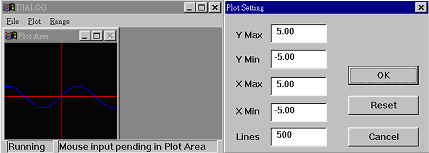图 17.5

这个范例程序使用对话窗让使用者设定绘图时的X、Y轴范围，以及所使用的线段数目。

*DIALOG.F90*
```f90
  1.!
  2.! 使用菜单及对话窗的范例
  3.! By Perng 1997/9/22
  4.program Menu_Demo
  5.use DFLIB
  6.implicit none
  7.  type(windowconfig) :: wc
  8.  integer :: result 
  9.  integer :: i,ix,iy
 10.
 11.  wc.numxpixels=200 ! 窗口的宽
 12.  wc.numypixels=200 ! 窗口的高
 13.  ! -1代表让程序自行去做决定
 14.  wc.numtextcols=-1 ! 每行容量的文字
 15.  wc.numtextrows=-1 ! 可以有几列文字
 16.  wc.numcolors=-1  ! 使用多少颜色
 17.  wc.title="Plot Area"C ! 窗口的标题
 18.  wc.fontsize=-1
 19.  ! 根据wc中所定义的数据来重新设定窗口大小
 20.  result=SetWindowConfig(wc)
 21.  ! 把程序放入等待鼠标信息的状态
 22.  do while (.TRUE.)
 1.   i = waitonmouseevent(MOUSE$RBUTTONDOWN, i, ix, iy)
 24.  end do
 25.end program
 26.!
 27.! 程序会自动执行这个函数, 它会设定窗口的外观
 28.!
 29.logical(kind=4) function InitialSettings()
 30.use DFLIB
 31.implicit none
 32.  logical(kind=4) :: result
 33.  type(qwinfo) :: qw
 34.  external PlotSin,PlotCos 
 35.  external SetRange
 36. 
 37.  ! 设定整个窗口程序一开始出现的位置及大小
 38.  qw.type=QWIN$SET
 39.  qw.x=0
 40.  qw.y=0
 41.  qw.h=400
 42.  qw.w=400
 43.  result=SetWSizeQQ(QWIN$FRAMEWINDOW,qw)
 44. 
 45.  ! 组织第一组菜单
 46.  result=AppendMenuQQ(1,$MENUENABLED,'&File'C,NUL)
 47.  result=AppendMenuQQ(1,$MENUENABLED,'&Save'C,WINSAVE)
 48.  result=AppendMenuQQ(1,$MENUENABLED,'&Print'C,WINPRINT)
 49.  result=AppendMenuQQ(1,$MENUENABLED,'&Exit'C,WINEXIT) 
 50.  ! 组织第二组菜单
 51.  result=AppendMenuQQ(2,$MENUENABLED,'&Plot'C,NUL)
 52.  result=AppendMenuQQ(2,$MENUENABLED,'&sin(x)'C,PlotSin)
 53.  result=AppendMenuQQ(2,$MENUENABLED,'&cos(x)'C,PlotCos)
 54.  ! 组织第三组菜单
 55.  result=AppendMenuQQ(3,$MENUENABLED,'&Range'C,SetRange)
 56.
 57.  InitialSettings=.true.
 58.  return
 59.end function InitialSettings
 60.!
 61.! 记录全局变量
 62.!
 63.module Global
 64.implicit none
 65.  real(kind=8) :: X_Start=-5.0  ! x轴最小范围
 66.  real(kind=8) :: X_End=5.0  ! x轴最大范围
 67.  real(kind=8) :: Y_Top=5.0  ! y轴最大范围
 68.  real(kind=8) :: Y_Buttom=-5.0 ! y轴最小范围
 69.  integer  :: lines=500  ! 用多少线段来画函数曲线
 70.  integer  :: Function_Num=0 ! 使用第几号函数来画图
 71.end module 
 72.!
 73.! 画sin的子程序
 74.!
 75.subroutine PlotSin(check)
 76.use DFLIB
 77.use Global
 78.implicit none
 79.  logical(kind=4) :: check
 80.  real(kind=8), external :: f1
 81.  integer :: result
 82.  check=.true.
 83.  Function_Num=1
 84.  ! 在第二组菜单的第一个选项,也就是sin的前面打个勾
 85.  result=ModifyMenuFlagsQQ(2,1,$MENUCHECKED)
 86.  ! 把选项cos前的勾取消
 87.  result=ModifyMenuFlagsQQ(2,2,$MENUUNCHECKED)
 88.  call Draw_Func(f1)
 89.  return
 90.end subroutine
 91.!
 92.! 画cos的子程序
 93.!
 94.subroutine PlotCos(check)
 95.use DFLIB
 96.use Global
 97.implicit none
 98.  logical(kind=4) :: check
 99.  real(kind=8), external :: f2
100.  integer :: result
101.  check=.true.
102.  Function_Num=2
103.  ! 把选项sin前的勾取消
104.  result=ModifyMenuFlagsQQ(2,1,$MENUUNCHECKED)
105.  ! 在选项cos前打个勾
106.  result=ModifyMenuFlagsQQ(2,2,$MENUCHECKED)
107.  call Draw_Func(f2)
108.  return
109.end subroutine
110.!
111.! 按下Range时,会执行这个子程序
112.!
113.subroutine SetRange(check)
114.use Global
115.use Dialogm
116.implicit none
117.  logical(kind=4) :: check
118.  real(kind=8), external :: f1,f2
119.  external ReSetRange
120.  ! 因为想在对话窗中保留上一次的设定结果,所以安排了下列的变量
121.  real(kind=8),save :: OX_Start=-5.0  ! x轴最小范围
122.  real(kind=8),save :: OX_End=5.0  ! x轴最大范围
123.  real(kind=8),save :: OY_Top=5.0  ! y轴最大范围
124.  real(kind=8),save :: OY_Buttom=-5.0 ! y轴最小范围
125.  integer  ,save :: Olines=500  ! 用多少线段来画函数曲线
126.  include 'resource.fd' ! 对话窗的信息
127.  type(dialog) :: dl
128.  integer :: result  !
129.  character(len=20) :: str 
130.
131.  check=.true.
132.  ! 声明要使用代码为IDD_INPUT的对话窗, 并把显示这个对话窗的信息放
133.  ! 在dl中. 以后只要对dl来处理就等于对这个对话窗来工作
134.  result=DlgInit(IDD_INPUT, dl)
135.
136.  ! 下面要对dl所代表的对话窗中ID值为IDC_X_MIN的字段来设定初值
137.  ! 也就是设定IDD_INPUT中X min栏的内容
138. 
139.  ! 因为DlgSet无法使用read类型变量来设定,所以要先把它们转换成字符串
140.  write(str,'(f6.2)') OX_Start
141.  result=DlgSet(dl,IDC_X_MIN,str)
142.  ! 设定X max栏的内容
143.  write(str,'(f6.2)') OX_End
144.  result=DlgSet(dl,IDC_X_MAX,str)
145.  ! 设定Y min栏的内容
146.  write(str,'(f6.2)') OY_Buttom
147.  result=DlgSet(dl,IDC_Y_MIN,str)
148.  ! 设定Y max栏的内容
149.  write(str,'(f6.2)') OY_Top
150.  result=DlgSet(dl,IDC_Y_MAX,str)
151.  ! 设定Lines栏的内容
152.  write(str,'(I5)') OLines
153.  result=DlgSet(dl,IDC_LINES,str)
154.  ! 设定按下Reset时会执行的子程序
155.  result=DlgSetSub(dl,IDC_RESET, ReSetRange)
156.  ! 到此才真正显示出对话窗
157.  result=DlgModal(dl)
158. 
159.  if ( result==IDOK ) then
160.  ! 由字符串转成数值
161.  result=DlgGet(dl,IDC_X_MIN,str)
162.  read(str,*) OX_Start
163.  result=DlgGet(dl,IDC_X_MAX,str)
164.  read(str,*) OX_End
165.  result=DlgGet(dl,IDC_Y_MIN,str)
166.  read(str,*) OY_Buttom
167.  result=DlgGet(dl,IDC_Y_MAX,str)
168.  read(str,*) OY_Top
169.  result=DlgGet(dl,IDC_LINES,str)
170.  read(str,*) OLines
171.  ! 设定全局变量的值, 绘图时会取用这些数值
172.  X_Start=OX_Start
173.  X_End=OX_End
174.  Y_Top=OY_Top
175.  Y_Buttom=OY_Buttom
176.  Lines=OLines
177.  end if
178.  ! 由Function_Num的值来决定要画出第几个函数
179.  select case(Function_Num)
180.  case(0)
181.  ! Do Nothing
182.  case(1)
183.  call Draw_Func(f1)
184.  case(2)
185.  call Draw_Func(f2)
186.  end select
187.
188.  return
189.end subroutine
190.!
191.! 按下Reset会执行这个子程序
192.! dlg,id,callback会自动传入
193.subroutine ReSetRange( dlg, id, callbacktype )
194.use DialogM
195.implicit none
196.  type(Dialog) :: dlg
197.  integer :: id,callbacktype
198.  integer :: t1,t2
199.  integer :: result
200.  include 'resource.fd'
201.  ! 下面这两行没什么用,只是如果没有下面两行,Compile时会有Warning.
202.  t1=id
203.  t2=callbacktype
204.  ! 重新设定对话窗中每个字段的内容
205.  result=DlgSet(dlg,IDC_X_MIN,'-5.00')
206.  result=DlgSet(dlg,IDC_X_MAX,' 5.00')
207.  result=DlgSet(dlg,IDC_Y_MIN,'-5.00')
208.  result=DlgSet(dlg,IDC_Y_MAX,' 5.00')
209.  result=DlgSet(dlg,IDC_LINES,'500')
210.
211.  return
212.end subroutine 
213.!
214.! 画出所传入的函数图形来
215.!
216.subroutine Draw_Func(func)
217.use DFLIB
218.use Global
219.implicit none
220.  integer :: result  ! 取回绘图函数运行状态
221.  integer(kind=2) :: color  ! 设定颜色用
222.  real(kind=8) :: step  ! 循环的增量
223.  real(kind=8) :: x,y  ! 绘图时使用,每条小线段都连接
224.  real(kind=8) :: NewX,NewY ! (x,y)及(NewX,NewY)
225.  real(kind=8), external :: func ! 待绘图的函数
226.  type(wxycoord) :: wt  ! 返回上一次的虚拟坐标位置
227.
228.  call ClearScreen($GCLEARSCREEN) ! 清除屏幕
229.  ! 设定虚拟坐标范围大小
230.  result=SetWindow( .true. , X_Start, Y_Top, X_End, Y_Buttom )
231.
232.  ! 使用全彩RGB 0-255的256种色阶来设定颜色
233.  color=RGBToInteger(255,0,0)  ! 把控制RGB的三个值转换到color中
234.  result=SetColorRGB(color)  ! 利用color来设定颜色
235.
236.  call MoveTo_W(X_Start,0.0_8,wt)  ! 画X轴
237.  result=LineTo_W(X_End,0.0_8)  !
238.  call MoveTo_W(0.0_8,Y_Top,wt)  ! 画Y轴
239.  result=LineTo_W(0.0_8,Y_Buttom)  !
240.
241.  step=(X_End-X_Start)/lines  ! 计算小线段间的X间距
242.  ! 参数#FF0000是使用16进制的方法来表示一个整数
243.  result=SetColorRGB(#FF0000)
244. 
245.  ! 开始绘制小线段
246.  do x=X_Start,X_End-step,step
247.  y=func(x)  ! 线段的左端点
248.  NewX=x+step
249.  NewY=func(NewX) ! 线段的右端点
250.  call MoveTo_W(x,y,wt)
251.  result=LineTo_W(NewX,NewY)
252.  end do
253. 
254.  ! 设定程序结束后,窗口会继续保留
255.  result=SetExitQQ(QWIN$EXITPERSIST)
256.end subroutine Draw_Func
257.!
258.! 所要绘图的函数
259.!
260.real(kind=8) function f1(x)
261.implicit none
262.  real(kind=8) :: x
263.  f1=sin(x)
264.  return
265.end function f1
266.
267.real(kind=8) function f2(x)
268.implicit none
269.  real(kind=8) :: x
270.  f2=cos(x)
271.  return
272.end function f2
```

这个程序的编写过程有必要做一个介绍。

1.  打开 QuickWin 模式的 Project，把 `DIALOG.F90` 加入 Project 中。
2.  按下 Insert/Resource 选项，选择要新增 Dialog。
3.  利用 Dialog Resource 编辑工具来设计出所要使用的 Dialog
4.  储存编辑好的对话窗，并把 `*.RC` 檔加入 Project 中

这4个步骤都不会太难，只有第3步需要更进一步说明。新增一个 Dialog 类型的 Resource 后，可以在屏幕上看到一个刚出生的对话窗，它只有 OK、Cancel 这两个按钮而已，屏幕上同时还会出现编辑工具，可以经由鼠标把这些小组件拉到对话窗上来编辑。这些小组件中有一些数据需要设定，例如组件的ID值等等。

制作对话窗的详细步骤如下：

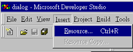图 17.6

选取Insert中的Rscource选项

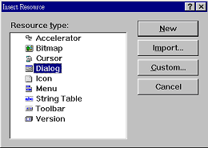图 17.7

选择所要新增的Resource类型是Dialog（对话窗）。

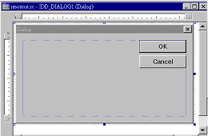图 17.8

会出现一个基本的对话窗来供编辑、修改

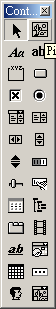图 17.9

这个窗口是用来编辑对话窗的组件，可以用鼠标来拖曳这些组件。

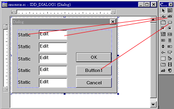图 17.10

把所需要的组件用鼠标拖曳到对话窗中。

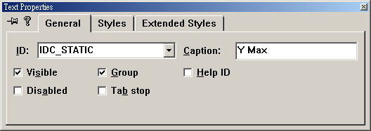图 17.11

在static组件上按两下，会出现属性设定窗口，在Caption栏可以改变显示文字。ID栏的值用来代表这个组件，在程序中可以用ID栏所指定的代号来读写组件的内容。

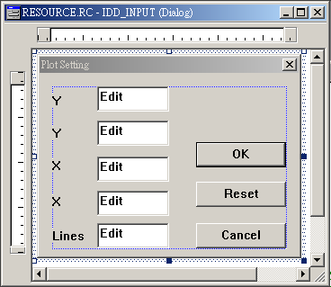图 17.12

这是编辑好的对话窗，设计对话窗时除了要注意外观外，最重要的是设定每个组件的ID代号。因为程序会从ID代号来读取对话窗中所输入的数据。

制作好对话窗之后，会储存成 `*.RC` 文件，请记得把 `*.RC` 文件加入Project中，不然对话窗做好了也等于没做。在储存RC文件时，Visual Fortran会自动产生一个 `*.FD` 文件，这个文件的内容是FORTRAN程序代码，它会声明一些跟对话窗相关的变量，这些变量可以用来操作对话窗，它们是组件的代码，读者可以试着把 `*.FD` 文件拿出来看。编写具备对话窗功能的程序时，要使用Visual Fortran所内附的MODULE DialogM，还要 `INCLUDE '*.FD'`，把产生出来的 `*.FD` 文件插入程序代码中。

跟上一个范例程序比较起来，这里只新增了两个子程序来控制对话窗。其它的部分几乎大同小异，只有把上个程序中的某些局部变量改成全局变量。

+ `subroutine SetRange` 负责显示对话窗。
+ `subroutine ReSet`  负责处理对话窗中Reset钮被按下的信息

程序代码中已经有相当程度的说明，在此只对几个函数做介绍：

+ `logical(4) function DLGINIT (id, dlg)`

    这个函数的目的是做显示对话窗前的预备工作，id值是指在制作对话窗时所给定的对话窗代码。可以在*.FD文件中找到所定义的数值及变量。dlg会返回对话窗的信息。

+ `logical(4) function DLGSET (dlg, controlid, value [ , index] )`

    设定对话窗上各个字段的内容。

    | | |
    | --- | --- |
    |`type(Dialog) :: Dlg`  | 变量要先经过DlgInit处理。在此它可以用来代表要对某个对话窗来工作|
    |`integer controlid`    |   在制作对话窗时组件的ID值。|
    |`real/integer/character value`|value的内容会被设定到窗口中controlid值所指的组件上。|
    |`integer index`        |   这个值不一定需要，是组件中又具备有小组件时用来指定小组件用的。|

+ `logical(4) function  DLGSETSUB (dlg, id, sub [ , index] )`

    设定某个组件被按下后会执行子程序sub。

    | | |
    | --- | --- |
    |`type(dialog) :: dlg`  | 变量要先经过DlgInit处理，在此它可以用来代表要对某个对话窗来工作|
    |`integer :: id`        | 在制作对话窗时组件的ID值。|
    |`external sub`         | 组件按下时会执行sub，子程序sub会得到3个参数：<br> `type(dialog) :: dlg` <br> 表示现在所使用的对话窗 <br> `integer :: id` <br> 被按下的组件代码 <br> `integer :: callbacktype` <br> 这个值可以不去理会|
    |`integer index`        | 这个值不一定需要，是一个组件当中又具备有小组件时用来指定小组件用的。|

对话窗的组件很丰富，建议读者可以不用每一项功能都去熟悉。其实只要学会上面那几个组件就可以处理很多问题了。

下面的范例程序当使用者按下Setcolor选项时，会出现一个对话窗来让使用者拉动滚动条来设定R、G、B色光的强度，改变设定的同时，会以三色光混合成的颜色画出一个实心方形。读者还可以使用File中的Save来储存目前的设定。

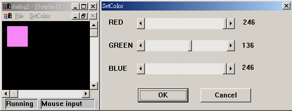图 17.13

*SETCOLOR.F90*
```f90
  1.!
  2.! 对话窗的范例之二
  3.! By Perng 1997/09/26
  4.program main
  5.use DFLIB
  6.implicit none
  7.  integer :: i,ix,iy
  8.
  9.  call ClearScreen($GCLEARSCREEN)
 10.  do while(.true.)
 1.   i = waitonmouseevent(MOUSE$LBUTTONDOWN, i, ix, iy)
 12.  end do
 13.end program
 14.!
 15.! 记录全局变量
 16.!
 17.module Global
 18.implicit none
 19.  integer, save :: red=0
 20.  integer, save :: green=0
 21.  integer, save :: blue=0
 22.end module
 23.!
 24.! 自定义菜单
 25.!
 26.logical(kind=4) function InitialSettings()
 27.use DFLIB
 28.implicit none
 29.  logical(kind=4) result
 30.  external FileOpen,FileSave
 31.  external SetColorDialog
 32.
 33.  result=AppendMenuQQ(1,$MENUENABLED,'File'C,NUL)
 34.  result=AppendMenuQQ(1,$MENUENABLED,'&Open'C,FileOpen)
 35.  result=AppendMenuQQ(1,$MENUENABLED,'&Save'C,FileSave)
 36.  result=AppendMenuQQ(1,$MENUENABLED,'&Exit'C,WINEXIT)
 37.
 38.  result=AppendMenuQQ(2,$MENUENABLED,'&SetColor',SetColorDialog)
 39. 
 40.  InitialSettings=result
 41.  return
 42.end function
 43.!
 44.! 处理Open
 45.!
 46.subroutine FileOpen(check)
 47.use Global
 48.implicit none
 49.  logical :: check
 50.  check=.true.
 51.  ! 打开一个空格符的文件, 会出现文件选择的对话窗来给使用者选择文件
 52.  open(unit=10, file=' ')
 53.  read(10,*) red
 54.  read(10,*) green
 55.  read(10,*) blue
 56.  close(10)
 57.  call DrawObject()
 58.  return
 59.end subroutine
 60.!
 61.! 处理Save
 62.!
 63.subroutine FileSave(check)
 64.use Global
 65.implicit none
 66.  logical :: check
 67.  check=.true.
 68.  ! 使用文件选择的对话窗
 69.  open(unit=20, file=' ')
 70.  write(20,*) red
 71.  write(20,*) green
 72.  write(20,*) blue
 73.  close(20)
 74.  return
 75.end subroutine
 76.!
 77.! 按下SetColor时会执行这个函数
 78.!
 79.subroutine SetColorDialog(check)
 80.use Global
 81.use DFLIB
 82.use dialogm
 83.implicit none
 84.  logical :: check
 85.  integer :: result
 86.  include 'resource.fd'
 87.  type(dialog) :: dlg
 88.  external ShowColor
 89.  character(len=10) output
 90.
 91.  check=.true.
 92.  result=DlgInit(IDD_SETCOLOR, dlg) ! 初始对话窗
 93.  ! 设定滚动条可以滚动的范围
 94.  result=DlgSet( dlg, IDC_SCROLLBAR1, 256, dlg_range )
 95.  result=DlgSet( dlg, IDC_SCROLLBAR2, 256, dlg_range )
 96.  result=DlgSet( dlg, IDC_SCROLLBAR3, 256, dlg_range )
 97.  ! 设定滚动条目前的位置
 98.  result=DlgSet( dlg, IDC_SCROLLBAR1, red, dlg_position )
 99.  result=DlgSet( dlg, IDC_SCROLLBAR2, green, dlg_position )
100.  result=DlgSet( dlg, IDC_SCROLLBAR3, blue, dlg_position )
101.! 上面有比较奇怪的用法, dlg_range代表要设定滚动条组件的范围值
102.! dlg_position代表要设定滚动条组件的位置. 读者可以想像当类型为dialog
103.! 的dlg被声明时, 编译器会自动声明出dlg_range, dlg_position等等
104.! 的变量并设定好它们的数值.
105.
106.  ! 写出红,绿,蓝三色光的强度数值
107.  write(output,"(I3)") red
108.  result=DlgSet( dlg, IDC_VALUE_RED, output )
109.  write(output,"(I3)") green
110.  result=DlgSet( dlg, IDC_VALUE_GREEN, output )
111.  write(output,"(I3)") blue
112.  result=DlgSet( dlg, IDC_VALUE_BLUE, output )
113.  ! 设定拉动滚动条时会执行的函数
114.  result=DlgSetSub( dlg, IDC_SCROLLBAR1, ShowColor )
115.  result=DlgSetSub( dlg, IDC_SCROLLBAR2, ShowColor )
116.  result=DlgSetSub( dlg, IDC_SCROLLBAR3, ShowColor )
117.  ! 显示对话窗
118.  result=DlgModal(dlg)
119.
120.  return
121.end subroutine
122.!
123.! 取出三色光的设定并画出一个实心方形
124.!
125.subroutine ShowColor(dlg,id,callbacktype)
126.use Global
127.use DFLIB
128.use dialogm
129.implicit none
130.  type(dialog) :: dlg
131.  integer :: id, callbacktype
132.  integer :: result
133.  character(len=10) :: output
134.  include 'resource.fd'
135.  ! 取出滚动条的位置
136.  result=DlgGet( dlg, IDC_SCROLLBAR1, red, dlg_position )
137.  result=DlgGet( dlg, IDC_SCROLLBAR2, green, dlg_position )
138.  result=DlgGet( dlg, IDC_SCROLLBAR3, blue, dlg_position )
139.  ! 因为颜色的变化范围是0-255, 而滚动条的范围是1-256, 所以要减1
140.  red=red-1
141.  green=green-1
142.  blue=blue-1
143.
144.  select case(id)
145.  case(IDC_SCROLLBAR1)  ! 第一个滚动条设定红色光强度
146.  write(output,"(I3)") red
147.  result=DlgSet( dlg, IDC_VALUE_RED, output )
148.  case(IDC_SCROLLBAR2)  ! 第二个滚动条设定绿色光强度
149.  write(output,"(I3)") green
150.  result=DlgSet( dlg, IDC_VALUE_GREEN, output )
151.  case(IDC_SCROLLBAR3)  ! 第三个滚动条设定蓝色光强度
152.  write(output,"(I3)") blue
153.  result=DlgSet( dlg, IDC_VALUE_BLUE, output )
154.  end select
155.
156.  call DrawObject()
157.
158.  return
159.end subroutine
160.!
161.! 以设定的颜色画出实心方形
162.!
163.subroutine DrawObject()
164.use Global
165.use DFLIB
166.implicit none
167.  integer :: result
168.  integer :: color
169.
170.  color=RGBToInteger(red,green,blue)
171.  result=SetColorRGB(color)
172.  result=Rectangle($GFILLINTERIOR,10,10,50,50)
173. 
174.  return
175.end subroutine
```

程序代码中已经有足够的注释，在此不再多做说明。


----


## 17-4   Visual Fortran绘图函数总览

Visual Fortran的绘图函数大部分是函数，调用后的返回值大多是用来说明函数是否正常执行。几何绘图函数通常有两个版本，函数名称最后为「_W」的使用虚拟坐标，不然就使用窗口坐标。使用虚拟坐标时，都使用双精度浮点数来传递坐标值。

在下面的函数说明中，不会详细列出两种版本的绘图函数。在函数名称最后有[_W]代表这个函数另外还有使用虚拟坐标的版本。例如ARC[_W]代表有两个函数，分别叫做ARC及ARC_W，ARC_W使用虚拟坐标，参数类型会改用双精度浮点数。

+ `integer(2) function ARC[_W](x1,y1,x2,y2,x3,y3,x4,y4)`

    画弧形，要指定一个矩形范围，弧形会画在这个矩形范围内的椭图上

    | | |
    | --- | --- |
    |`integer(2) x1,y1,x2,y2` | 矩形范围的两个端点|
    |`integer(2) x3,y3` | 弧形的起始向量|
    |`integer(2) x4,y4` | 弧形的结束向量|

+ `subroutine CLEARSCREEN(area)`

    清除屏幕

    `integer(4) area` 设定所要清除的范围，有下列的定义值可以使用：

    + `$GCLEARSCREEN`  清除整个屏幕
    + `$GVIEWPORT`  清除目前所设定的可用范围
    + `$GWINDOW`  清除所设定的文字窗口范围

+ `integer(2) function ELLIPSE[_W](control, x1, y1, x2, y2)`

    在指定的矩形范围内画椭圆

    | | |
    | --- | --- |
    |`integer(2) control` | 设定要填满内部或是只画外框，有下列的定义值可以使用： <br> `$GFILLINTERIOR` 涂满整个内部 <br>    `$GBORDER` 只画外框|
    |`integer(2) x1,y1` | 矩形端点1|
    |`integer(2) x2,y2` | 矩形端点2|

+ `integer(2) function FLOODFILL[_W](x,y,bcolor)`

    把一个封闭空间上色。

    | | |
    | --- | --- |
    |`integer(4) x,y` | 封闭区间内的坐标点|
    |`integer bcolor` | 用INDEX模式来设定颜色|

+ `integer(2) function FLOODFILLRGB[_W](x,y,color)`

    把一个封闭空间上色。

    | | |
    | --- | --- |
    |`integer(4) x,y`   | 封闭区间内的坐标点|
    |`integer color`    | 用RGB模式来设定颜色|

+ `integer(2) function GETCURRENTPOSITION[_W]( t )`

    查询目前的画笔位置

    `type(xycoord) t` 返回目前画笔的所在位置，使用虚拟坐标时t的类型为 `type(wxycoord)`

+ `integer(2) function GETPIXEL[_W]( x, y )`

    取得(x,y)点的颜色，返回值为INDEX模式的颜色值。

+ `integer(4) function GETPIXELRGB[_W]( x, y )`

    取得(x,y)点的颜色，返回值为RGB模式的颜色值。

+ `subroutine GETPIXELS( n, x, y, color )`

    一次取得许多点的颜色数据（Index Color模式）

    | | |
    | --- | --- |
    |`integer(4) n` |想取得多少点|
    |`integer(2) x(n),y(n)` |要传入两个数组，用来设定所要读取的坐标。|
    |`integer(2) color(n)` |颜色数据会放在这个数组中|

+ `subroutine GETPIXELSRGB( n, x, y, color )`

    一次取得许多点的颜色数据（RGB Color模式），参数同上，不过color改用integer(4)类型。

+ `subroutine INTEGERTORGB(rgb, red, green, blue)`

    把传入的rgb整数值分解成red、green、blue三部分

    | | |
    | --- | --- |
    |integer(4) rgb|传入所要分解的rgb颜色值|
    |integer(4) red,green,blue|返回分解出来的红、绿、蓝色光值|

+ `integer(2) function LINETO[_W]( x, y )`

    从目前画笔位置到(x,y)间画一条直线。

    integer(2) x,y 指定画线的终点

+ `subroutine MOVETO[_W]( x, y, t)`

    | | |
    | --- | --- |
    |integer(2) x,y|设定画笔坐标位置|
    |type(xycoord) t|返回上次的画笔位置|

+ `integer(2) function PIE[_W](fill,x1,y1, x2,y2, x3,y3, x4,y4)`

    画扇形，要指定一个矩形范围，扇形会画在这个矩形范围内的椭图上

    | | |
    | --- | --- |
    |integer(2) fill|设定只画外框或画实心的扇形|
    |integer(2) x1,y1,x2,y2|椭圆的矩形范围|
    |integer(2) x3,y3,x4,y4|扇形的起始及终点向量|

+ `integer(2) function POLYGON[_W]( control, ppoints, cpoints )`

    绘制多边形

    | | |
    | --- | --- |
    |integer(2) control|设定只画外框或画实心的多边形|
    |type(xycoord) ppints(cpoints)|用数组来传入多边形的顶点坐标|
    |integer(2) cpoints|传入的坐标点数目|

+ `integer(2) function RECTANGLE[_W]( control, x1, y1, x2, y2 )`

    画矩形

    | | |
    | --- | --- |
    |integer(2) control|设定只画外框或画实心的矩形|
    |integer(2) x1,y1,x2,y2|设定矩形的范围|

+ `integer(4) function RGBTOINTEGER( red, green, blue)`

    把传入的red,green,blue值转换成一个长整数返回。red值会放在0~7 bits，green会放在8~15 bits，blue会放在16~23 bits。

    `integer(2) red,green,blue` 传入的红、绿、蓝色光值

+ `integer(2) function SETPIXEL[_W](x,y)`

    用目前设定的颜色在指定坐标处画点（Index Color模式）

    `integer(2) x,y` 画点的坐标

+ `integer(2) function SETPIXELRGB[_W](x,y)`

    用目前设定的颜色在指定坐标处画点（RGB Color模式）

    `integer(2) x,y` 画点的坐标

+ `subroutine SETPIXELS( n, x, y, color )`

    一次画许多个点（Index Color模式）

    | | |
    | --- | --- |
    |`integer(2) n`|要画几个点|
    |`integer(2) x(n),y(n)`|传入要画的坐标点|
    |`integer(2) color(n)`|传入每个点的颜色|

+ `subroutine SETPIXELSRGB( n, x, y, color)`

    一次画许多个点（RGB Color模式），参数同上，除了color改用integer(4)类型。

下面要介绍跟文字相关的函数，使用WRITE/READ来读写QuickWin窗口时可以使用下列的函数。

+ `integer(2) function DISPLAYCURSOR(toggle)`

    控制光标的显示

    | | |
    | --- | --- |
    |`integer(2) toggle` | 控制是否显示光标，有下列的定义值可以使用 <br> `$GCURSOROFF` 不显示光标 <br> `$GCURSORON` 显示光标|

+ `integer(4) function GETBKCOLOR()`

    返回背景颜色（Index Color模式）

+ `integer(4) function GETBKCOLORRGB()`

    返回背景颜色（RGB Color模式）

+ `integer(4) function GETTEXTCOLOR()`

    返回目前文字的颜色（Index Color模式）

+ `integer(4) function  GETTEXTCOLORRGB()`

    返回目前文字的颜色（RGB Color模式）

+ `subrotuine GETTEXTPOSITION( t )`

    返回目前文字的输出位置

    `type(rccord) t` 返回目前文字的输出位置

+ `subroutine GETTEXTWINDOW( r1, c1, r2, c2 )`

    返回目前文字窗口的设定范围

    `integer(2) r1,c1,r2,c2` 返回目前文字窗口的设定范围

+ `subroutine OUTTEXT(text)`

    在目前的文字输出位置写出字符串text的内容

    `character*(*) text` 所要输出的字符串内容

+ `subroutine SCROLLTEXTWINDOW(rows)`

    把文字向上滚动rows行

    `integer(2) rows` 想要滚动的行数

+ `subroutine SETBKCOLOR(color)`

    设定背景颜色（Index Color模式）

    `integer(4) color` 所要设定的颜色

+ `subroutine SETBKCOLORRGB(color)`

    设定背景颜色（RGB Color模式）

    `integer(4) color` 所要设定的颜色

+ `subroutine SETTEXTPOSITION(row, column, t)`

    设定文字输出的位置

    `integer(2) row,column` 设定文字输出的位置

+ `subroutine SETTEXTWINDOW(r1, c1, r2, c2)`

    设定文字窗口的范围

    `integer(2) r1,c1,r2,c2` 设定文字窗口的左上角及右下角范围

+ `integer(2) function WRAPON(option)`

    设定文字输出超过窗口范围时是否会自动换行

    `integer(2) option` 有两个数值可代入:  

     + `$GWRAPOFF`会自动换行
     + `$GWRAPON` 不会换行

下面是使用字型的函数，这里的函数可以使用Windows中所安装的TrueType字型。

+ `integer(2) function GETFONTINFO(font)`

    取得目前使用字型的信息

    `type(fontinfo) font` 返回目前使用字型的信息

+ `integer(2) function GETGTEXTEXTENT(text)`

    返回这个字符串输出时会占用的屏幕点数

    `character*(*) text` 传入的字符串

+ `integer(2) function GETGTEXTROTATION()`

    返回目前设定的字符串输出角度

    `integer(4) result` 返回输出角度值的10倍

+ `subroutine SETGTEXTROTATION(degrees)`

    设定字符串的输出角度

    `integer(4) degrees` 用角度值的10倍数值来设定文字的输出角度

+ `subroutine OUTGTEXT(text)`

    在目前画笔位置输出字符串

    `character*(*) text` 所要输出的字符串

+ `integer(2) function INITIALIZEFONTS()`

    使用字型前的准备工作，要使用TrueType字型时，一定要先调用这个函数。

+ `integer(2) function SETFONT(options)`

    设定所要使用的字型

    `character*(*) options` 使用文字叙述来设定要使用的字型，要描述的内容有「字型」、「长宽」、「样式」等等。

    option的设定方法如下：

    + `t'FontName'` 指定使用的字型
    + `hy`  其中的y值会设定字型的高度
    + `wx`  其中的x值会设定字型的宽度
    + `f`  使用固定大小的字型
    + `p`  使用可变大小的字型
    + `v`  使用向量字型
    + `r`  使用点矩阵字型
    + `e`  设定为粗体的样式
    + `u`  设定为有底线的样式
    + `i`  设定为斜体的样式
    + `b`  自动设定没有指定的数据
    + `n`  用编号来设定字型

举一个例子，`result=SetFont( 't"Times New Roman"h12w10')` 会使用 12*10 的 Times New Roman 字型。

接下来要介绍跟图像相关的函数

+ `subroutine GETIMAGE[_W](x1,y1,x2,y2,image)`

    抓取屏幕上一块矩形区域图像到内存中

    | | |
    | --- | --- |
    |`integer(2) x1,y1,x2,y2`|指定一个矩形区域|
    |`integer(1) image(n)`|用来储存图形的数组|

+ `integer(2) IMAGESIZE[_W](x1,y1,x2,y2)`

    计算抓取这个矩形区域图像所要使用的数组大小

    `integer(2) x1,y1,x2,y2` 指定所要计算的矩形区域

+ `subroutine PUTIMAGE[_W](x,y,image,action)`

    把图形画到屏幕上

    | | |
    | --- | --- |
    |`integer(2) x,y`|指定要画到屏幕上的位置，图形左上角会对应到这个位置|
    |`integer(1) image(*)`|所要显示的图像数据|
    |`integer(2) action`|控制图形要画到屏幕上前所要做的计算，有下列的定义可代入：<br> `$GAND` 和原先在屏幕上的点做AND运算 <br> `$GOR` 和原先在屏幕上的点做OR运算 <br> `$GXOR` 和原先在屏幕上的点做XOR运算 |

+ `integer(2) LOADIMAGE[_W](filename, x, y)`

    读取bmp图文件，把它显示在画面上。

    | | |
    | --- | --- |
    |`character*(*) filename`|指定要读入的图文件|
    |`integer(4) x, y`|显示图形时所使用的左上角坐标|

+ `integer(2) function SAVEIMAGE[_W](filename, x1,y1, x2,y2)`

    把屏幕上的一块矩形区域图像储存成bmp图文件

    | | |
    | --- | --- |
    |`character*(*) filename`|所要储存的文件|
    |`integer(4) x1,y1,x2,y2`|指定矩形的范围|
